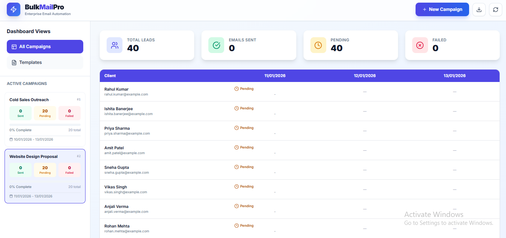
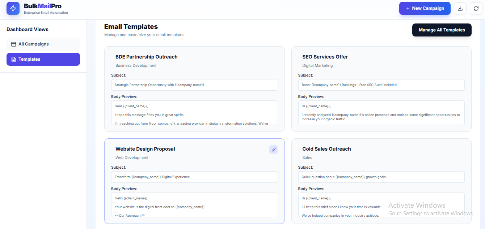
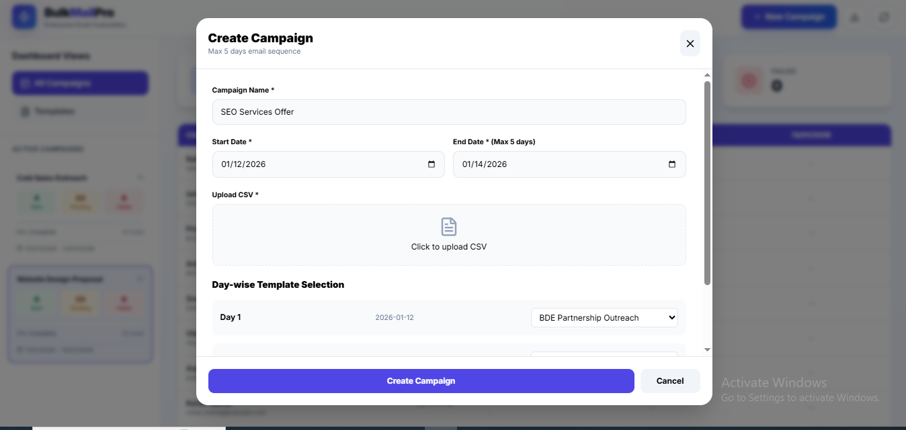

# BulkMailPro 🚀
A scalable bulk email automation system built with **Frontend + Backend APIs + n8n**, supporting sheet-based client uploads and multi-SMTP email delivery.

---

## 📌 Overview
**BulkMailPro** allows users to upload a client list via a sheet (CSV/Excel) and configure campaign details from the frontend.  
The backend processes the data and triggers **n8n automation**, which sends emails using **multiple SMTP accounts** with tracking for sent and failed emails.

---

## ✨ Key Features

### UI / Frontend Features
- **Dashboard**: View all campaigns, active campaigns, and campaign progress
- **Campaign Creation**: Form with campaign name, start/end date, CSV upload, and day-wise template selection
- **Template Management**: Create, edit, delete, and preview email templates
- **Client Sheet Upload**: Upload CSV with `client_name` and `client_email`
- **Email Status Tracking**: Visual tracking of sent, pending, and failed emails per campaign
- **Responsive Design**: Works on desktop and tablet
- **Quick Actions**: Duplicate campaigns, download reports, manage templates

**Images (UI Preview)**

---

## 🔁 Automation Workflow (n8n)

### Flow Overview
1. **Receive webhook** from frontend on campaign creation
2. **Process client list** (split rows into items)
3. **Merge with template** (subject + body)
4. **Select SMTP account** dynamically (round-robin to prevent throttling)
5. **Send emails**
6. **Capture response** and update status in backend (Sent / Failed)
7. **Batch processing** for campaigns with 1000+ clients

### Email Status Tracking
Each email record stores:
- `campaign_id`  
- `client_name`  
- `client_email`  
- `smtp_used`  
- `sent_time`  
- `status` (sent / failed)  
- `error_message` (if failed)

---

## 📄 Client Sheet Format

| client_name | client_email |
|------------|--------------|
| Ravi Kumar | ravi@gmail.com |
| Neha Singh | neha@gmail.com |

> Only these 2 columns are required. Extra columns are ignored.

---

## 📝 Campaign Fields

| Field Name | Source |
|----------|--------|
| campaign_id | Backend (auto-generated) |
| campaign_name | Frontend |
| start_date | Frontend |
| end_date | Frontend |
| template_id | Frontend (template selection) |
| subject_snapshot | Backend (from template) |
| body_snapshot | Backend (from template) |
| email_status | Backend (sent / failed) |

---

## 🔐 Security Best Practices
- ❌ No SMTP credentials exposed on frontend
- ✅ All secrets stored securely in backend / n8n
- ✅ Environment variables (.env) used and ignored in git
- ✅ API-based communication only

---

## 🧪 Scalability
- Supports 3000+ clients per campaign
- Multiple SMTP accounts for load balancing
- Easy to extend to MySQL/PostgreSQL, CRM, analytics dashboards

---

## 🚀 Tech Stack
- **Frontend:** React.js  
- **Backend:** Node.js / n8n Webhooks  
- **Automation:** n8n  
- **Email Sending:** SMTP (multiple providers)  
- **Data Upload:** CSV / Excel

---

## 📌 Use Cases
- Bulk email campaigns  
- Marketing automation  
- Client outreach  
- Event notifications  
- CRM email flows  

---

## 👨‍💻 Author
Built with ❤️ for scalable email automation using n8n.

